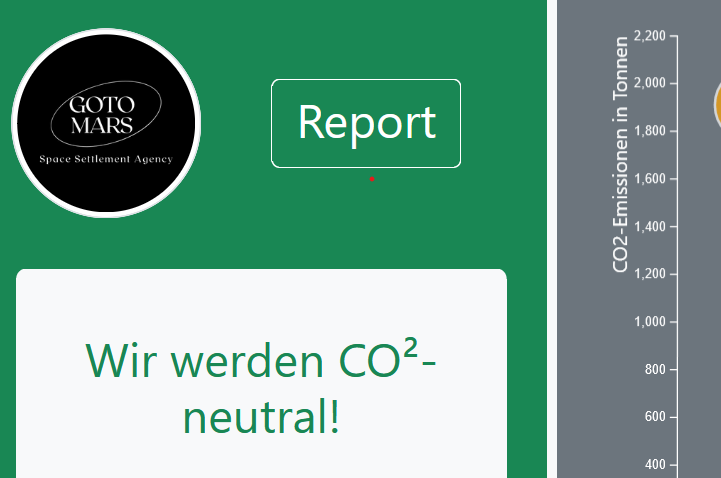

# Maria Zieglmeier's Portfolio

Welcome! This repository contains a number of web development projects and assignments I implemented during my master's program at *University of Bamberg*. 

For technical details, please go to `./src/projects/[projectname]`. 

## Master Thesis Project

In my master thesis, I focused on developing different methods for personalized data storytelling. This prototype thematizes the user's personal reading dataset, discussing trends in the individual data and giving personalized recommendations.

**Skills:** Modern JavaScript · git · Node.js · React · d3.js · OpenAI API
 
**Timeframe:** Summer semester 2024

**Details:** [./src/projects/MasterProject-main](https://github.com/MariaZ63/marias-uni-projects.github.io/tree/main/src/projects/MasterProject-main)

## React Book Management Applicaton

This project focused on getting to know the essentials of modern web development: Tools like Webpack, Babel and Eslint, Frameworks like React, agile development in teams and much more. Implemented in a group of five.

**Skills:** Modern JavaScript · git · Webpack · Babel · ESLint · Node.js · TDD · vitest · React 

**Timeframe:** Winter semester 2023/24

**Details:** [./src/projects/iBooks](https://github.com/MariaZ63/marias-uni-projects.github.io/tree/main/src/projects/iBooks)

## Svelte Logbook

The final assigment for the fictional GOTO-Mars project. This logbook application focuses on applying a component-based framework, in this case Svelte. 

**Skills:** Svelte · git · localstorage · JavaScript · Bootstrap 

**Timeframe:** Summer semester 2023

**Details:** [./src/projects/LogBook](https://github.com/MariaZ63/marias-uni-projects.github.io/tree/main/src/projects/LogBook)

## Single Page Application

As an assignment for a class on web technologies, three fellow students and I were tasked to develop a single page application for the fictional research project 'GOTO Mars Research', displaying their data about rocket missions to Mars. We implemented an API that allows the client to fetch the JSON data and use it for a counter and a visualization.

**Skills:** git · d3.js · Express.js · JavaScript · Bootstrap 

**Timeframe:** Summer semester 2023

**Details:** [./src/projects/SPA](https://github.com/MariaZ63/marias-uni-projects.github.io/tree/main/src/projects/SPA)

## d3 Graph Visualization

This was a graded assignment for my information visualization class. The base was a dataset about publications. The goal was to implement a node-link-diagram where the nodes represent keywords that were used in the publications, and the links are keywords that are used in the same publications. The node size encodes the number of publications using the keyword. I implemented a click interaction that lists the publications using a selected keyword. The graph layout was achieved using d3-force. Furthermore, the data was filtered so that only the nodes and links above a certain size limit are displayed.

**Skills:** d3.js · Javascript 

**Timeframe:** Summer semester 2023

**Details:** [./src/projects/D3_Graph_Visualization](https://github.com/MariaZ63/marias-uni-projects.github.io/tree/main/src/projects/D3_Graph_Visualization)

## d3 Scatterplot

As a graded assignment for a information visualization class, I received a dataset about movies. The task was to implement a visualization from scratch, using d3.js. The goal was to visualize the movies by the 15 directors who had directed the most movies, as well as 3 additional variables. I chose to symbolize the movie genre by color and the profitability of a movie by two overlaying circles. Furthermore, I implemented a hover interaction (showing details to the selected movie) and a click interaction (highlighting movies of the same genre).

**Skills:** d3.js · JavaScript 

**Timeframe:** Summer semester 2023

**Details:** [./src/projects/D3_Scatterplot](https://github.com/MariaZ63/marias-uni-projects.github.io/tree/main/src/projects/D3_Scatterplot)

## Data Comic

During an information visualization project, I created this comic with two fellow students. I was responsible for all the drawings, as well as the research, storytelling and implementation of the part about data gaps in crash testing.

**Skills:** git · Data storytelling · jQuery · CSS 

**Timeframe:** Winter semester 2022/23

**Details:** [./src/projects/Data_Comic](https://github.com/MariaZ63/marias-uni-projects.github.io/tree/main/src/projects/Data_Comic)