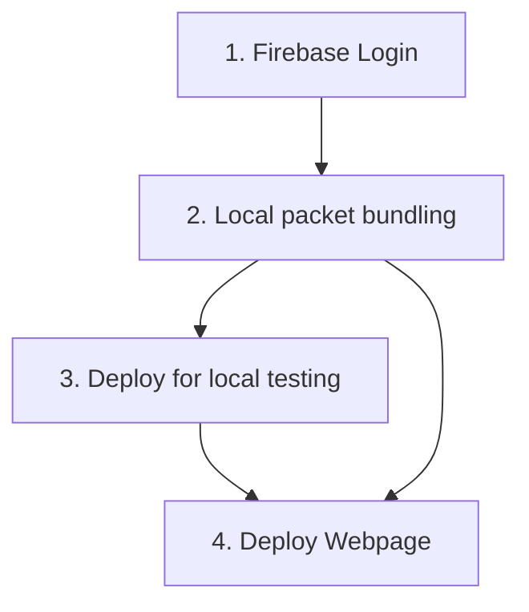

# Deployment Process
Deployment process describes how to upload a current iBook App version to the Firebase hosting server to deploy it online. 
[Firebase-Hosting](https://firebase.google.com/docs/hosting?hl=de)

### 1. Firebase Login
Log in for the Firebase hosting service, to be able to upload a current version of iBooks to the server.
1. For Login enter the following command in the CLI (Command Line Interface): `firebase login` 
A browser window will then open in which the login data must be entered. The login data can be found in the .env.local file.
- To check a successful login and thus a connection to Firebase, enter the following command in the CLI: `firebase projects:list` 
A list should then be displayed in which the iBooks project is listed. When the list with the iBooks project is displayed, a successful connection to the Firebase server was established.

### 2. Local Packet Bundling
Use Vite Bundle (build) process to create distributable version of iBooks application.
1. Create a compact version of the iBooks app for publishing using the following CLI command: `npm run build` 
- Now the current files created for publication should be available in the project folder dist

### 3. (optional) Deploy for local testing (upload to Server)
Upload the app to the web server for local testing
1. With the following CLI command the created iBooks version can be uploaded from the dist project folder to the Firebase server to test its function locally: `firebase emulators:start` 
In order to call the iBooks app locally via the Firebase server, the return addresses from the CLI return must be observed

### 4. Deploy Webpage (upload to Server)
Upload iBooks app to web server
1. With the following CLI command, the version from the dist folder of the project will be uploaded to the firebase server, making the iBooks app available online: `firebase deploy`
- The app should then be available at the following web address: [https://ibook-80766.web.app](https://ibook-80766.web.app)
