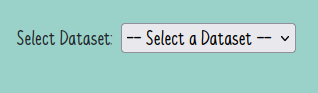

# Table of Contents
1. [Introduction](#introduction)
2. [Local Deployment](#local-deployment)
3. [Operating Instructions](#operating-instructions)
4. [Author](#author)

# Introduction
This prototype is an exploration of the concept of personalized interactive data comics. Its subject is the personal data of its reader - in this case the reading data collected by a reading application like *Goodreads* or *StoryGraph*. Furthermore, the data comic aims to adapt to the reader's individual needs and preferences, e.g. by connecting to the *OpenAI API*. 

The prototype can be found at [https://personal-datacomic.web.app]().

# Local Deployment
If you prefer to test the application locally, you can do so by following the instructions: 

**Requirements:** Node.js 
1. Download or clone this repository.
2. Run `npm install` to install all required packages. 
3. Run `npm run dev` to start a local development server at [http://localhost:5173/](). 

# Operating Instructions

When you open the page, you will be asked to select a dataset. The numbering corresponds to that of the evaluator, with the additional index 0, which is the author's dataset:
- **dataset0:** author
- **dataset1:** participant 1
- **dataset2:** participant 2
- **dataset3:** participant 3
- **dataset4:** participant 4
- **dataset5:** participant 5
- **dataset6:** participant 6

After selecting a dataset, you will be redirected to the personal data comic of the participant and you can navigate through it. 

# Author
**Maria Zieglmeier** 
Email: [maria-magdalena.zieglmeier@stud.uni-bamberg.de]()
